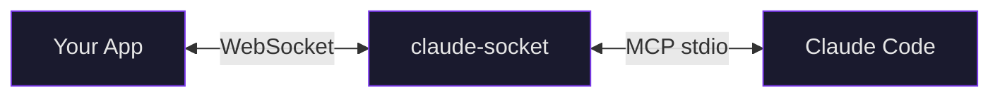
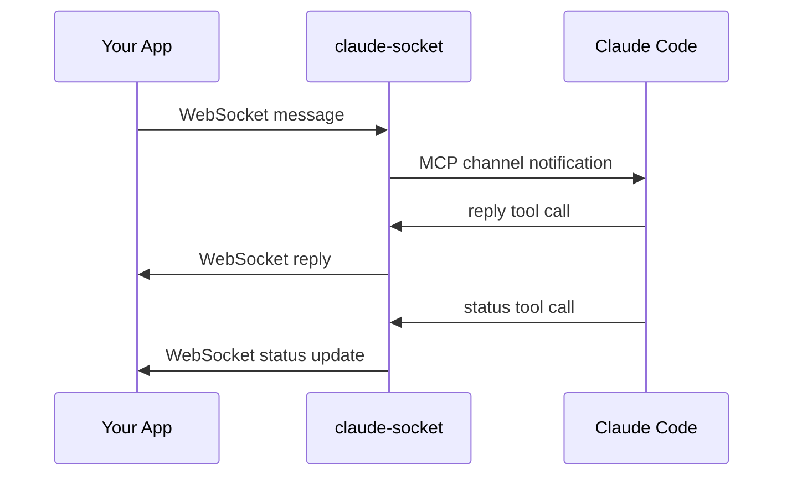

# claude-socket

[](LICENSE)
[](https://bun.sh)
[](https://docs.anthropic.com/en/docs/claude-code)

A general-purpose WebSocket bridge for Claude Code's channel system. Connect any application — web UIs, mobile apps, IoT devices, dashboards, bots — to a live Claude Code session over WebSocket.

## Architecture



claude-socket runs as a Claude Code MCP plugin. It sits between your application and Claude Code, translating WebSocket messages into MCP channel notifications and MCP tool calls back into WebSocket messages.



The plugin is a single Bun process that serves two roles:
- **MCP server** on stdio — Claude Code calls `reply`, `status`, and `fetch_messages` tools
- **WebSocket server** on a TCP port — your app connects, sends messages, receives replies

## When to Use claude-socket

Claude Code's channel system lets external sources inject messages into a running session. claude-socket exposes that capability over WebSocket, so anything that can open a WebSocket connection can talk to Claude Code.

**Use cases:**
- **Web dashboards** — build a chat UI that talks to your Claude Code agent
- **Mobile apps** — send commands to Claude Code from your phone
- **Discord/Slack bots** — bridge chat platforms to Claude Code
- **IoT & hardware** — trigger Claude Code actions from sensors or buttons
- **Multi-user interfaces** — multiple clients sharing a session, all seeing replies
- **Remote control** — approve Claude's tool permissions from a browser instead of the terminal

**What you get:**
- Real-time bidirectional communication with Claude Code
- Session multiplexing — multiple clients can share a session
- Permission relay — approve/deny Claude's tool calls from your UI
- Message history buffer — late-joining clients can catch up
- Auto-reconnect with exponential backoff (client library)
- Zero-dependency browser client

## Quick Start

### 1. Install the plugin

```bash
claude plugin marketplace add cunicopia-dev/claude-socket
claude plugin install claude-socket
```

### 2. Start Claude Code with the channel

claude-socket uses Claude Code's [channel system](https://docs.anthropic.com/en/docs/claude-code) to receive messages. Start a session with the channel loaded:

```bash
claude --channels plugin:claude-socket@claude-socket
```

The WebSocket server starts automatically on port 3100. Connect a browser, send a message, and Claude Code sees it in the session.

To continue an existing session:

```bash
claude -c --channels plugin:claude-socket@claude-socket
```

### 3. Try the example

Open `examples/basic/index.html` in your browser. Type a message. Claude replies through the WebSocket.

### Alternative: `--plugin-dir` (local development)

If you don't want to install via the marketplace, clone the repo and point Claude Code at it directly. Local plugins require `--dangerously-load-development-channels` instead of `--channels` since they aren't on the approved channel allowlist:

```bash
git clone https://github.com/cunicopia-dev/claude-socket.git
claude --plugin-dir /path/to/claude-socket/plugin \
  --dangerously-load-development-channels plugin:claude-socket@localhost
```

### Alternative: `--mcp-config` (manual)

Load it as a raw MCP server for full control over the config:

```bash
claude --mcp-config '{"mcpServers":{"claude-socket":{"command":"bun","args":["run","/path/to/claude-socket/plugin/server.ts"],"env":{"CLAUDE_SOCKET_PORT":"3100"}}}}'
```

### Run the Tests

```bash
cd plugin
bun install
bun test.ts
```

## Configuration

| Environment Variable   | Default       | Description                     |
|------------------------|---------------|---------------------------------|
| `CLAUDE_SOCKET_PORT`   | `3100`        | WebSocket server port           |
| `CLAUDE_SOCKET_HOST`   | `127.0.0.1`  | WebSocket server bind address   |

## Client Library

The `client/` package exports a `ClaudeSocket` class. Zero dependencies, works in any browser or JS runtime.

```ts
import { ClaudeSocket } from 'claude-socket'

const socket = new ClaudeSocket('ws://localhost:3100', {
  session: 'my-app',
  user: 'alice',
})

socket.on('reply', (msg) => {
  console.log(`Claude: ${msg.content}`)
})

socket.on('permission_request', (msg) => {
  const allowed = confirm(`Allow ${msg.tool_name}?\n${msg.input_preview}`)
  socket.respondToPermission(msg.request_id, allowed)
})

socket.connect()
socket.send('Hello Claude!')
```

### Constructor Options

| Option | Default | Description |
|--------|---------|-------------|
| `session` | `"default"` | Session ID for multiplexing |
| `user` | `"user"` | Username sent with messages |
| `reconnect` | `true` | Auto-reconnect on disconnect |
| `reconnectDelay` | `1000` | Initial reconnect delay (ms) |
| `maxReconnectDelay` | `30000` | Max reconnect delay (ms) |

### Methods

| Method | Description |
|--------|-------------|
| `connect()` | Open the WebSocket connection |
| `send(content)` | Send a message to Claude Code |
| `fetchHistory(limit?)` | Request message history from the buffer |
| `respondToPermission(id, allowed)` | Answer a permission request |
| `disconnect()` | Close connection, stop reconnecting |
| `on(event, callback)` | Subscribe to events (returns unsubscribe fn) |

### Events

| Event | Payload | Description |
|-------|---------|-------------|
| `connected` | — | WebSocket connected |
| `disconnected` | — | WebSocket disconnected |
| `reply` | `ReplyMessage` | Claude sent a reply |
| `status` | `StatusMessage` | Thinking/tool_use/idle indicator |
| `history` | `HistoryMessage` | Message history response |
| `permission_request` | `PermissionRequestMessage` | Claude needs tool permission |
| `error` | `ErrorMessage` | Error from the server |
| `message` | `ServerMessage` | Any server message (catch-all) |

## Protocol Reference

### Client -> Server

#### `message`
```json
{"type": "message", "session_id": "default", "content": "Hello!", "user": "alice", "ts": "2026-01-01T00:00:00Z"}
```

#### `fetch_history`
```json
{"type": "fetch_history", "session_id": "default", "limit": 50}
```

#### `permission_response`
```json
{"type": "permission_response", "request_id": "abc123", "allowed": true}
```

### Server -> Client

#### `reply`
```json
{"type": "reply", "session_id": "default", "message_id": "a1b2c3d4", "content": "Hello!", "ts": "2026-01-01T00:00:01Z"}
```

#### `status`
```json
{"type": "status", "session_id": "default", "status": "thinking", "detail": "reading files"}
```

Values: `thinking`, `tool_use`, `idle`

#### `history`
```json
{"type": "history", "session_id": "default", "messages": [{"role": "user", "content": "Hello", "ts": "..."}]}
```

#### `permission_request`
```json
{"type": "permission_request", "session_id": "default", "request_id": "abc123", "tool_name": "Bash", "description": "Run a command", "input_preview": "ls -la"}
```

#### `error`
```json
{"type": "error", "session_id": "default", "message": "something went wrong"}
```

### MCP Tools

| Tool | Parameters | Description |
|------|------------|-------------|
| `reply` | `chat_id`, `text` | Send a reply to WebSocket clients |
| `status` | `chat_id`, `status`, `detail?` | Push a status indicator |
| `fetch_messages` | `session_id`, `limit?` | Read the session's message buffer |

## Sessions

Multiple clients can share a session by connecting with the same session ID. Messages broadcast to all clients in a session. Sessions are created on first connection and cleaned up 5 minutes after the last client disconnects.

```
ws://localhost:3100?session=my-session
```

## Permission Relay

When Claude Code needs approval for a tool call, the request is forwarded to all connected clients. Your UI presents an allow/deny prompt, and the response flows back to Claude Code through the same bridge. This lets you approve Claude's actions from anywhere — not just the terminal.

## License

Apache 2.0
